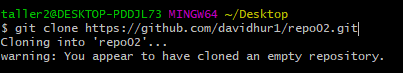

# Ejercicio 2

1. Creamos el repositorio repo 02 y lo clonamos

    
    

2. Creamos este archivo y hacemos un commit
   
   

    |Comando |Explicación |
    |:--- |:---- |
    |innit| genera un repositorio en la carpeta designada |
    | add | añade archivos al stage area, puedes poner los archivos individualmente o todos a la vez utilizando "git add ." |
    | status| te informa sobre el estado de los archivos, si estan añadidos, no añadidos o modificados|
    |commit -m| subre los archivos al repositorio local "hace falta poner un mensaje de subida" |
    |log| registro de los commits hechos |
    |push| sube los archvios que hayas hecho commit al repositorio remoto |
    |pull| actualizamos el contenido de nuestro repositorio local añadiendo los cambios del repositorio remoto |
    |clone| clonamos un repositorio remoto a local |